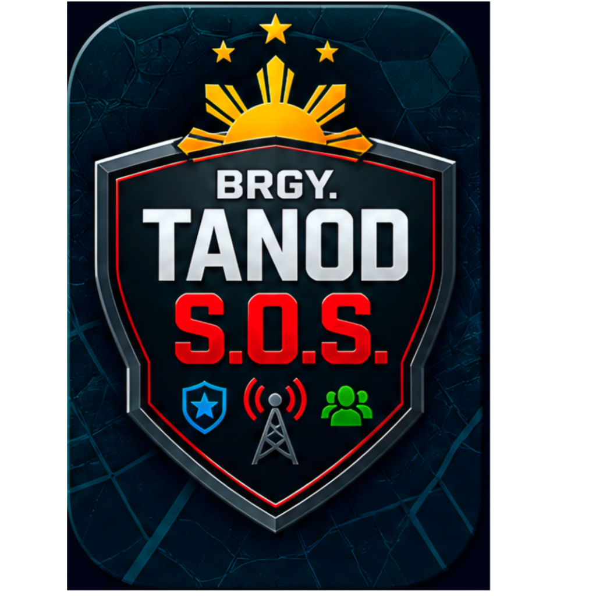
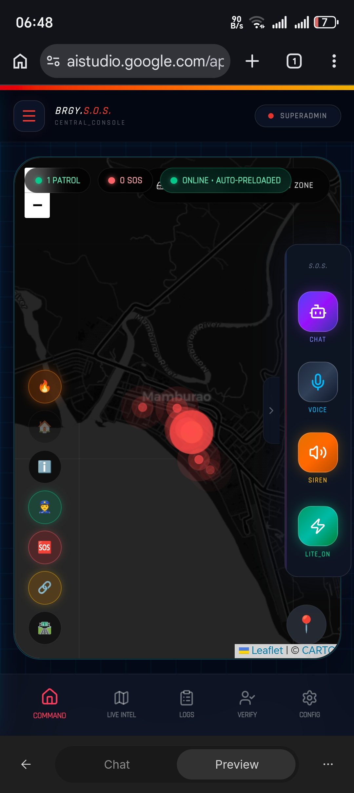
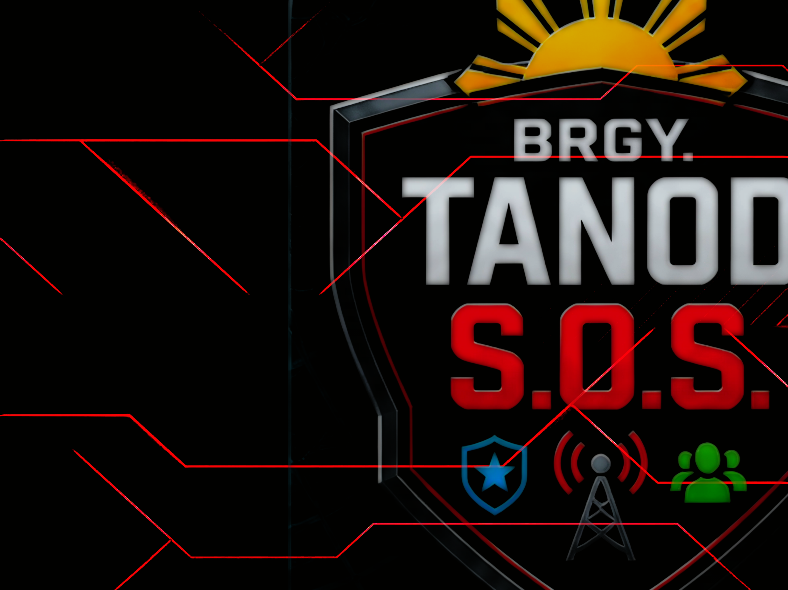

<div align="center">



# 🚨 BRGY. TANOD S.O.S

**Real-time Emergency Response System for Philippine Barangays**

[](https://github.com/MiB1968/Brgy.Tanod-S.O.S)
[](https://react.dev)
[](https://www.typescriptlang.org)
[](https://firebase.google.com)
[](https://github.com/MiB1968/Brgy.Tanod-S.O.S)

> A responsive, **offline-first**, **PWA-first** SOS alert system designed for Local Government Units (Barangays).
> It connects citizens directly to Barangay Tanods with reliable performance even in **low-connectivity** and **typhoon-prone** areas.

[🚀 Quick Start](#-quick-start) • [✨ Features](#-key-features) • [🛠 Tech Stack](#-tech-stack) • [🛡 Security](#-security) • [📸 Screenshots](#-screenshots)

</div>

---

## 📸 Screenshots

| Client View | Tactical GPS | Responder Portal |
|:-----------:|:------------:|:----------------:|
|  |  |  |

| Command Center | Tanod Roster | Super Admin |
|:--------------:|:------------:|:-----------:|
|  |  |  |

---

## ✨ Key Features

### 🆘 Core Emergency Features

| Feature | Description |
|---|---|
| **Floating SOS Button** | Long-press activation with one-tap emergency alert |
| **Real-time Tanod Tracking** | Live location with direction indicators and heatmap |
| **Offline-First SOS** | Queued alerts with auto-sync when connection returns |
| **Multi-Channel Fallback** | Firebase + Twilio SMS during network outages |
| **Hybrid TTS (Tagalog Support)** | Multiple voice options including local dialects |

---

### 🛡 AI Guardian Mode *(Highlight Feature)*

**AI Guardian Mode** is an intelligent, privacy-first voice assistant powered by **WebLLM** — a local AI engine running entirely in the browser.

- 🎙 **Voice-activated SOS** — Speak naturally in Tagalog or English
  *(e.g., "Tulong! May sunog!" or "Help, emergency!")*
- 🧠 **Context-aware assistance** — Answers common barangay queries offline
  *(e.g., "Saan ang pinakamalapit na health center?")*
- 📋 **Real-time emergency guidance** — Step-by-step instructions while waiting for Tanods
- 🔒 **Local AI Processing** — Runs entirely on-device (no cloud dependency, better privacy, works offline)
- ☁️ **Hybrid Fallback** — Switches to Google Gemini when online for complex queries
- 👋 **Super Admin Greeting** — Personalized voice welcome for barangay officials

> This feature makes the app accessible to elderly residents and users with limited literacy.

---

### ⚙️ Advanced Capabilities

- **PWA + Aggressive Offline Map Tiles** — Installable app with cached Leaflet maps
- **Role-Based Dashboards** — Citizen, Tanod, Admin, and Super Admin views
- **Patrol Logging & Broadcast System** — Tanod activity logs and system-wide announcements
- **Geofencing Ready** — Future hotspot alerts (background tracking via Capacitor)
- **Tactical GPS** — Real-time Tanod-to-Citizen streaming via WebSockets/Firebase
- **Patrol Scheduler** — Manage officer shifts and patrol sectors
- **Live Emergency Feed** — Command center with live incident monitoring

---

## 🛠 Tech Stack

### Frontend

| Technology | Purpose |
|---|---|
| React 19 + TypeScript + Vite | Core framework |
| Tailwind CSS | Styling |
| Zustand | State management |
| Leaflet + react-leaflet + Heatmap | Maps & visualization |
| vite-plugin-pwa (Workbox + Background Sync) | PWA & offline support |
| @mlc-ai/web-llm + ONNX Runtime | Local AI (AI Guardian Mode) |
| Framer Motion | Animations |

### Backend & Services

| Technology | Purpose |
|---|---|
| Firebase (Auth, Firestore, Functions, Storage) | Auth, database, real-time |
| Express + Socket.io | Real-time communications |
| Drizzle ORM | PostgreSQL / CockroachDB |
| Twilio | SMS fallback during outages |
| Google Gemini | Cloud AI fallback |

### Mobile

| Technology | Purpose |
|---|---|
| Progressive Web App (PWA) | Primary delivery |
| Capacitor | Native Android/iOS builds |

---

## 🚀 Quick Start

```bash
# 1. Clone the repository
git clone https://github.com/MiB1968/Brgy.Tanod-S.O.S.git
cd Brgy.Tanod-S.O.S

# 2. Install dependencies
npm install

# 3. Set up environment variables
cp .env.example .env
# Edit .env with your Firebase, Twilio, and Gemini credentials

# 4. Start the development server
npm run dev
```

> ⚠️ **Never commit your `.env` file.** It is included in `.gitignore` by default.

---

## 🚨 Background Tanod Tracking

Real-time location tracking for Tanods with **background support**, **offline queuing**, and **geofencing**.

- Location updates transmitted via WebSockets + Firebase
- Continues tracking when the app is minimized (via Capacitor background plugin)
- Offline GPS positions are queued locally and synced when connectivity resumes
- Heatmap overlay shows high-incident zones for patrol prioritization

---

## 🛡 Security

This project has undergone a structured **security audit** covering authentication, data encryption, and API access control.

**Key hardened areas:**
- ✅ JWT token revocation properly enforced
- ✅ Resident PII encrypted at rest
- ✅ Audit logging for sensitive actions
- ✅ Role-based access control (Citizen / Tanod / Admin / Super Admin)
- ✅ Database indexing for performance and integrity
- ✅ OTP endpoint authentication enforced

> For responsible disclosure of security vulnerabilities, please contact the maintainer directly rather than opening a public issue.

---

## 👥 Role-Based Access

| Role | Access |
|---|---|
| **Citizen / Resident** | SOS alerts, AI Guardian, live patrol map, emergency hotlines |
| **Tanod** | Responder portal, duty status, GPS broadcast, intel reports |
| **Admin** | Full dashboard, resident management, broadcast system |
| **Super Admin** | System config, all admin capabilities, personalized AI greeting |

---

## 🤝 Contributing

Contributions are welcome! Please open an issue first to discuss what you would like to change.

1. Fork the repo
2. Create your feature branch: `git checkout -b feature/your-feature`
3. Commit your changes: `git commit -m 'Add your feature'`
4. Push to the branch: `git push origin feature/your-feature`
5. Open a Pull Request

---

## 📄 License

This project is licensed under the [MIT License](LICENSE).

---

<div align="center">

**Powering Safer Communities Through Tactical Intelligence**

*Brgy. Tanod S.O.S — Secure Response Framework*

Built with ❤️ by **Ruben Llego O.** — Owner & Lead Web Developer
*Certified AI Specialist · System Architect*

</div>
